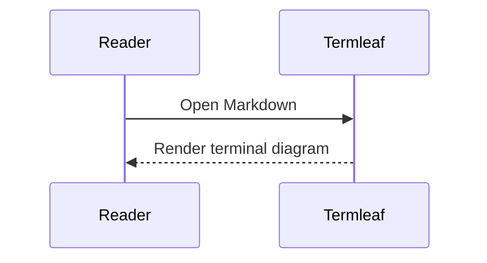
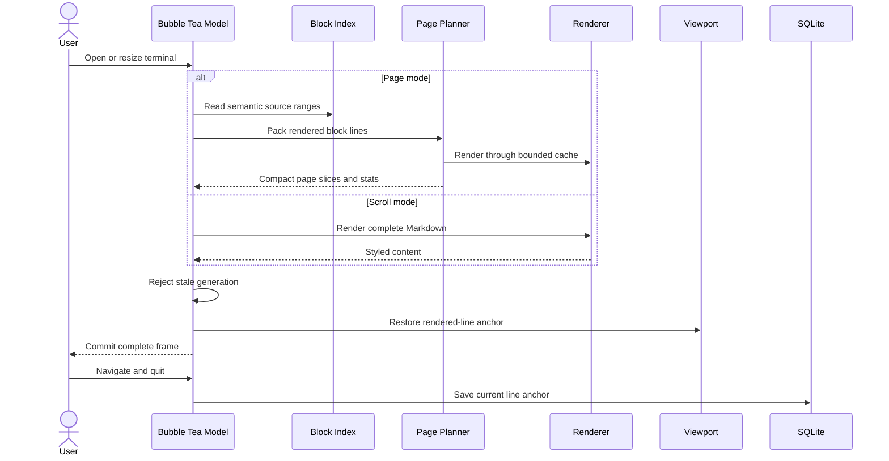

# Termleaf

A responsive terminal Markdown reader built with Go and Bubble Tea v2.

## Current features

- Styled Markdown rendering with Glamour
- Continuous scrolling and pageable `-p` mode
- Responsive page controls such as `◀ 1 … 4 [5] 6 … 20 ▶`
- Current-page word count, reading time, and progress
- SQLite-backed reading-position restoration
- Semantic source anchors survive terminal resize, theme wrapping, and renderer changes
- Legacy line/progress positions migrate automatically and remain as fallbacks
- Case-insensitive `/` search with `n`/`N` result navigation
- Semantic bookmarks persisted in SQLite
- Semantic block indexing that keeps fenced code and Mermaid intact
- Dedicated flicker-free Mermaid canvas with horizontal and vertical panning
- Page mode stores compact source slices instead of every rendered page
- Incremental page discovery with one-page lookahead prefetch
- Local standalone PNG, JPEG, and GIF images
- Cell-safe Kitty graphics negotiation in `--images=auto` mode
- Conservative ANSI-pixel fallback inside tmux and uncertain terminals
- iTerm2/Sixel available through the expert `TERMLEAF_IMAGE_PROTOCOL` override
- Stable ANSI half-block rendering with `--images=pixels`
- Alt-text-only reading with `--images=off`
- Images work in both continuous and `-p` page modes
- Responsive scaling capped to the reading column and 12 terminal rows
- 25 MiB / 40-megapixel decode limits protect memory usage
- Missing, unsafe, and remote images degrade to sanitized alt-text diagnostics
- Unknown totals render as `1 [2] 3 … ?` until the document end is discovered
- `G` completes discovery and jumps to the real last page
- Concurrency-safe LRU with a 2 MiB rendered-payload budget
- Flicker-resistant asynchronous re-rendering with stale-result rejection

Link navigation and PDF support are planned next.

## Install and run

Install the latest tagged version:

```bash
go install github.com/tolaniverse/termleaf/cmd/termleaf@latest
termleaf version
termleaf README.md
termleaf -p README.md
termleaf --images=pixels README.md
termleaf --images=off README.md
termleaf --mmdc README.md        # explicitly allow browser-backed Mermaid rendering
```

Upgrade a release installation in place:

```bash
termleaf update
```

`termleaf update` checks the latest stable GitHub release, downloads the archive for the current OS and architecture, verifies it against the release's SHA-256 `checksums.txt`, and atomically replaces the executable. On Windows, updating a running executable may be unavailable; use `go install ...@latest` there if replacement fails. If the install directory is not writable, use `go install ...@latest` instead.

Maintainers publish a version by pushing a semantic tag such as `v0.1.0`; the release workflow runs tests and GoReleaser creates checksummed Linux, macOS, and Windows archives. Development builds report `dev` and intentionally cannot self-update.

## Mermaid diagrams

Fenced Mermaid blocks remain readable as source in the document. When one is visible, press `v` on the `[ v ] View Mermaid Diagram` action to open it in a full-terminal canvas:

````markdown

````

The diagram canvas renders once, then arrow keys or `h/j/k/l` pan across the cached result without rerendering or flicker. `Esc`, `q`, or `v` returns to the exact reading position. The lightweight embedded renderer handles flowchart, sequence, and ER diagrams. When `mmdc` is installed and `--mmdc` is explicitly supplied, other Mermaid types are rendered to a temporary PNG and passed through Termleaf's terminal-image pipeline. Oversized, invalid, or unavailable diagrams fall back to sanitized Mermaid source.

```bash
# Optional: enables graphical fallback for Mermaid types without embedded support
npm install -g @mermaid-js/mermaid-cli
termleaf --mmdc guide.md
```

## Controls

| Key | Scroll mode | Page mode |
|---|---|---|
| `j/k`, `↑/↓` | Scroll | — |
| `Space`, `b` | Page down/up | Next/previous page |
| `←/h`, `→/l` | — | Previous/next page |
| `g/G` | Start/end | First/last page |
| `/` | Search document | Search document |
| `n/N` | Next/previous match | Next/previous match |
| `v/V` | View next/previous visible Mermaid diagram | View next/previous visible Mermaid diagram |
| `m` | Toggle bookmark | Toggle bookmark |
| `B` | Next bookmark | Next bookmark |
| `?` | Help | Help |
| `q` | Save and quit | Save and quit |

## Rendering sequence



## Roadmap

1. Link navigation and safe opening
2. PDF document backend
